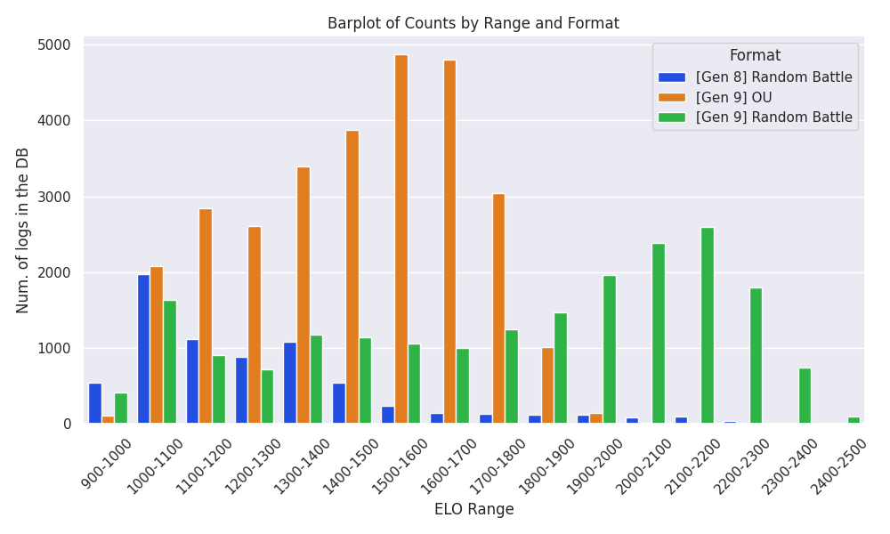
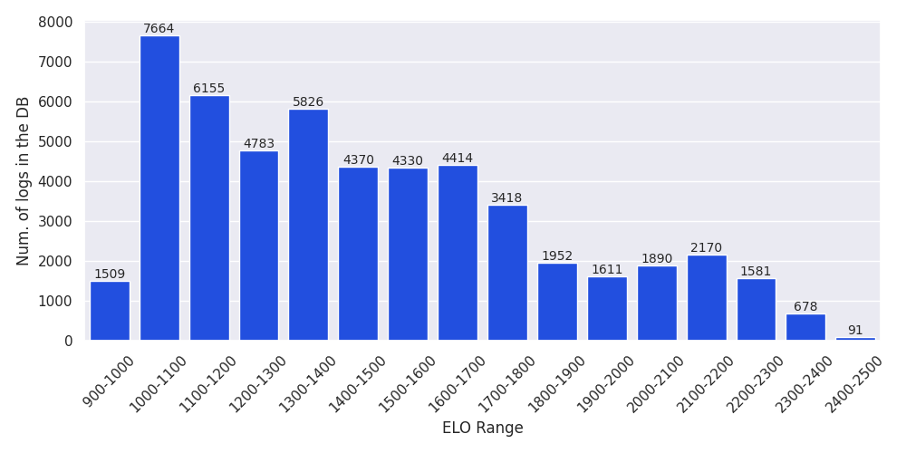
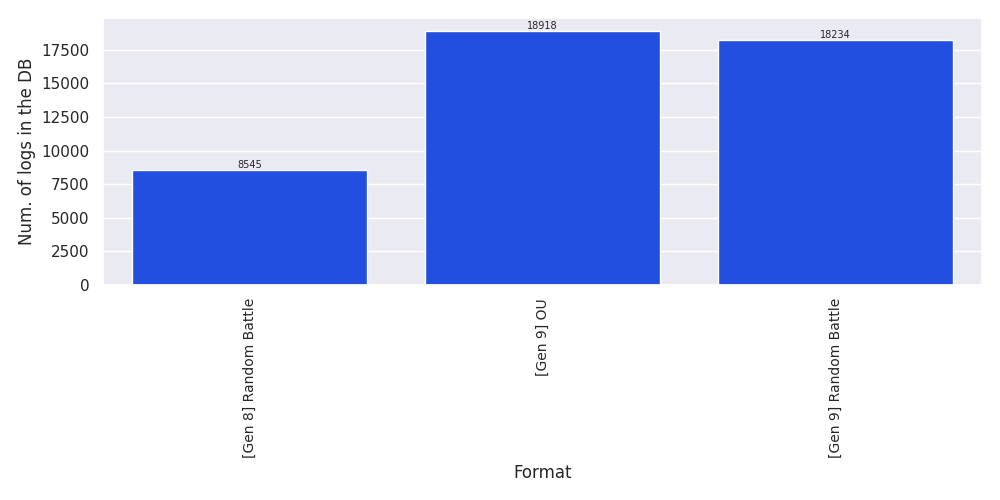

# Battle Scraper
A simple python cron job to save Pokèmon showdown logs in a database.


## Quick Setup
First, setup virtual env and install dependencies:

```bash
python3 -m venv .venv

pip install -r requirements.txt
```

Then, just run the following command to start the job:

```bash
python3 cron.py
```
The script save each log from recently played section.

## Configuration
You can specify for which format do you want to retrieve the logs. This can be done in `consts.py` file where you can add or remove formats.

## How it works
The script `cron.py` will run indefinitely scraping the [replay section](https://replay.pokemonshowdown.com/), to retrieve battle logs, from four sources:
- the recently played section, which is updated frequently with new battles.
- the formats section
- via players search scraped from ladders (scraping top player names from the [ladder](https://pokemonshowdown.com/ladder))
- via players search scraped from online members in the forum

The script schedules asynchronous jobs to run periodically and scraping each sources, the replays found are saved in a global queue, then if the replay is not in the database, the actual log is retrieved and saved in database.
Data about replays is injected dynamically as a `json`. The `json` contains several information for each battle, such as:
- the `rating` that is the ELO.
- the `format` of the battle.
- the `id` which is a unique identifier of the battle `<battle-format>-<battle-id>`.
Scrapers retrieve these informations, then the unique `id` can be used to retrieve the real battle text `log` searching for the following url:

    https://replay.pokemonshowdown.com/<battle-format>-<battle-id>.log

Then, for each battle `id` in the `json` we save the tuple (`id`, `format`, `rating`, `log`) in a sqlite database named by default `logs.db`.

If you plan to run this script indefinitely, or in a public server you may want to limit the maximum size of the database, this can be done specifing max size in bytes `--size`, so that if the db size reaches the maximum `cron.py` will stop.

To change the schedule time for each scraping function you can add the following tags (in seconds):
```bash
python3 --wait.recents 10 --wait.formats 10 --wait.players 20
```
## Logging statistics about collected data
You can run:

```bash
python3 stats.py
```
to generate statistics about data in the db, currently the script generates images regardin total
amount of data per format and also infomation of ELO per format:



