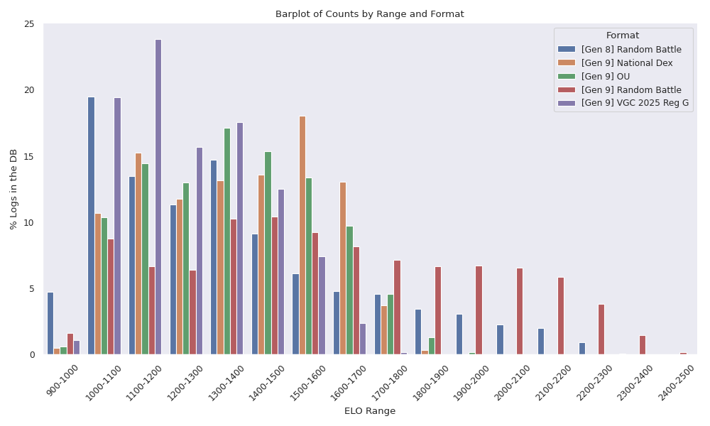
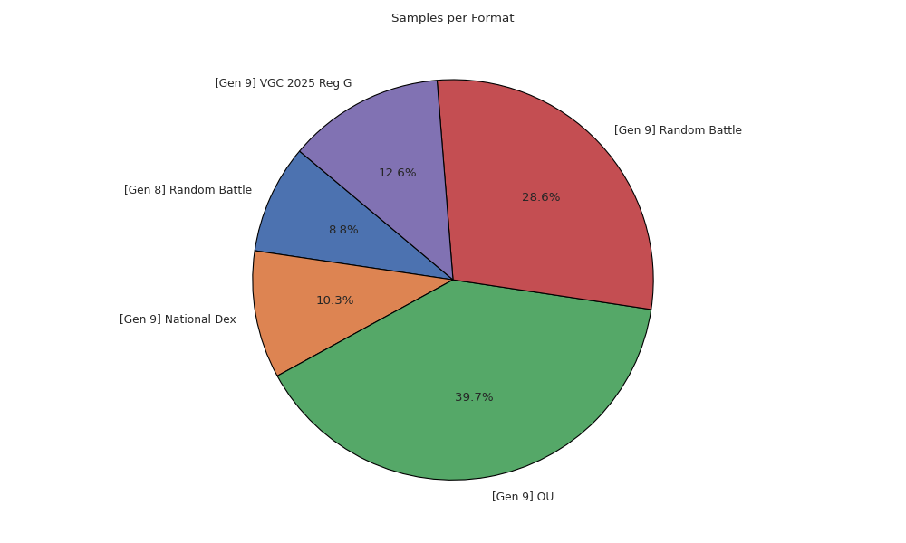
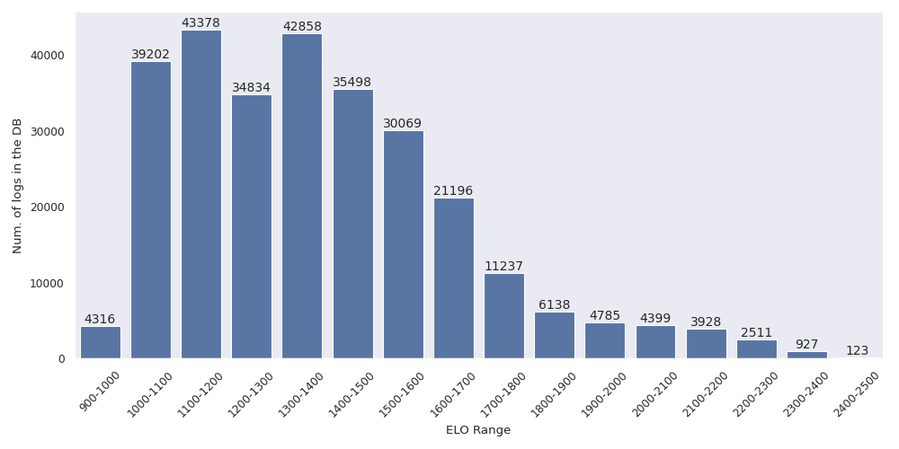

# Battle Scraper
A simple python cron job to save Pokèmon showdown logs in a database.


## Quick Setup
First, setup virtual env and install dependencies:

```bash
python3 -m venv .venv
source .venv/bin/activate
pip install -r requirements.txt
```

Then, just run the following command to start the job:

```bash
python3 cron.py
```
The script save each log from recently played section.

## Configuration
You can specify the **formats** of the logs to be scraped and the **chat** names to scrape new data. This can be done in `consts.py` file where you can add or remove formats.

You can set different timing for each scraping source (explained in next section)
```bash
python3 --wait.recents 10 --wait.formats 10 # seconds

# available job times (default)
    --wait.addlogs (10)
    --wait.recents (60)
    --wait.formats (7200)
    --wait.ladders (7200)
    --wait.members (1800)
    --wait.roomlst (300)
```

If you plan to run this script indefinitely, or in a public server you may want to limit the maximum size of the database:

```bash
python3 --size 100000000 # bytes, default set to (10 GB)
```
If the db size reaches the maximum size provided `cron.py` will stop.

## How it works
The script `cron.py` will run indefinitely scraping the [replay section](https://replay.pokemonshowdown.com/), to retrieve battle logs, from different sources:
- the recently played section, which is updated frequently with new battles.
- the formats search (selecting user-specified formats in `consts.py`)
- via players search, where active players are scraped from:
    - [ladders](https://pokemonshowdown.com/ladder) top players name (for high ELO logs)
    - forum online members
    - chats in play.pokemonshowdown

Each of the sources above is a function periodically running on an asynchronous job to retrieve `battle-id`. Such ids identify univocally a single replay log, and are saved by the scraping jobs on a shared buffer `replay`. Another job named `add_log` run frequently checking `replay` queue and requesting the actual text log only if doesn't already exists in database.

## Scraping Details
Data about replays is injected dynamically as a `json` in showdown website. The `json` contains several information for each battle, such as:
- the `rating` that is the ELO.
- the `format` of the battle.
- the `battle-id` which is a unique identifier of the battle `<battle-format>-<battle-id>`.

Scrapers sources retrieve these informations, then the unique `battle-id` can be used to retrieve the real battle text `log` searching for the following url:

    https://replay.pokemonshowdown.com/<battle-format>-<battle-id>.log

For each battle `id` in the `json` we save the tuple (`id`, `format`, `rating`, `log`) in a sqlite database named by default `logs.db`.

## Statistics about collected data
To log statistics, such as the total number of logs and number per format just run:

```bash
python3 stats.py
```

or for a more in depth visualization, run:
```bash
python3 stats.py --plot
```
to generate statistics about data in the db, currently the script generates images regarding total
amount of data per format and rating (ELO) per format:

<div style="text-align:center">

</div>

<div style="text-align:center">

</div>

<div style="text-align:center">

</div>